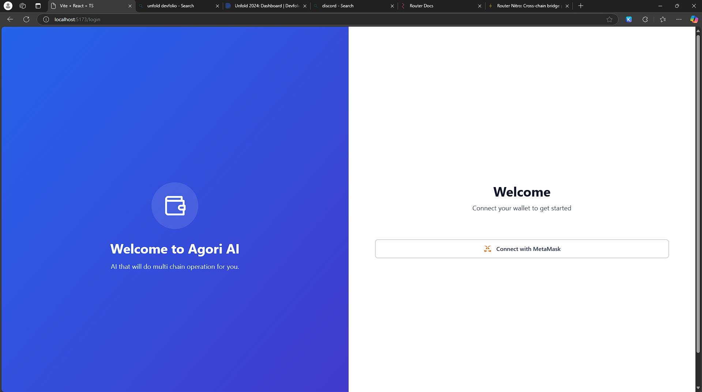

# Agori AI Chatbot

Agori AI is a cutting-edge AI chatbot designed to handle all your transactions within the chatbot interface itself. This project is divided into two parts: the backend (API) and the frontend (Web). Both parts are designed to seamlessly interact to provide an intelligent conversational experience for handling various transactions.



## Table of Contents

- [Overview](#overview)
- [Project Structure](#project-structure)
- [Backend Setup](#backend-setup)
- [Frontend Setup](#frontend-setup)
- [API Endpoints](#api-endpoints)
- [Usage](#usage)
- [Contributing](#contributing)
- [License](#license)

## Overview

Agori AI chatbot simplifies user transactions by using a conversational interface to handle everything, from information gathering to processing tasks. It is an intuitive and user-friendly AI system built using modern web technologies and powerful backend APIs. Users can initiate and complete transactions directly through the chatbot without needing to interact with separate systems.

### Key Features:
- AI-driven natural language processing for understanding and handling transactions.
- Backend API to manage and process requests.
- Frontend web application for user interaction with the chatbot.
- Real-time transaction updates and history management.

## Project Structure

This project is split into two main directories:

- **api/**: The backend API of the chatbot.
  - **controllers/**: Contains the logic for handling requests related to transactions.
  - **services/**: Contains services that interact with external systems or APIs.
  - **models/**: Contains data models for your application.
  - `server.js`: The main entry point for your backend application.
  - `.env`: File for environment variables.
  
- **web/**: The frontend application where users interact with the chatbot.

## Backend Setup

The backend API is built using Node.js and Express. Follow the instructions below to set it up:

### Prerequisites

- Node.js and npm (Node Package Manager) installed on your system.

### Steps to Run the Backend

1. Navigate to the `api` folder:
   ```bash
   cd /path/to/agori-ai-backend
   ```
2. Install the required dependencies:
   ```bash
   npm install
   ```
3. Set up environment variables (make sure to create a `.env` file in the `api` folder):
   - `PORT`: The port on which the backend API will run (default: 5000).
   - `AGORIC_URL`: URL to the Agoric network.
   - `ETHEREUM_URL`: URL to Ethereum RPC.
   - `ETHEREUM_SENDER`: Your Ethereum address.
   - `ETHEREUM_RECEIVER`: Receiver's Ethereum address.
   - `ETHEREUM_PRIVATE_KEY`: Your Ethereum private key.
4. Start the API server:
   ```bash
   npm start
   ```
   The backend API should now be running locally. By default, it will be available at http://localhost:5000.

## API Endpoints

Below are some of the API endpoints available in the backend:

1. **POST /api/transactions**
   - Create a new transaction.
   - **Request Body:**
     ```json
     {
       "type": "payment",
       "amount": 100.00,
       "currency": "USD",
       "chains": ["agoric", "ethereum"]
     }
     ```
   - **Response:**
     ```json
     {
       "status": "success",
       "message": "Transaction initiated successfully",
       "transactionId": "tx-123456789"
     }
     ```

2. **GET /api/transactions/:id**
   - Fetch the status of a transaction by its ID.
   - **Request Parameters:** id (Transaction ID).
   - **Response:**
     ```json
     {
       "transactionId": "tx-123456789",
       "status": "completed",
       "details": "Transaction completed successfully on both Agoric and Ethereum."
     }
     ```

## Frontend Setup

The frontend is built with React, and it communicates with the backend API to handle transactions.

### Prerequisites

- Node.js and npm installed.

### Steps to Run the Frontend

1. Navigate to the web folder:
   ```bash
   cd /path/to/agori-ai/web
   ```
2. Install the required dependencies:
   ```bash
   npm install
   ```
3. Set up environment variables (create a `.env` file in the web folder):
   - `REACT_APP_API_URL`: The URL of the backend API (e.g., http://localhost:5000).
4. Start the frontend development server:
   ```bash
   npm run dev
   ```
   The frontend should now be accessible at http://localhost:3000.

## Usage

Once both the frontend and backend are up and running, you can interact with the Agori AI chatbot directly through the web interface. The chatbot will guide you through various transaction steps, and you can communicate with it using natural language.

### Example Usage
- Starting a transaction: Type "Start a new transaction" to begin the process.
- Requesting a transaction status: Type "Check status of my last transaction."
- Completing a transaction: Type "Complete my current transaction" to finish the process.
- Getting help: Type "Help" for assistance with commands.

## Contributing

We welcome contributions! If you'd like to contribute to Agori AI, please follow these steps:

1. Fork the repository.
2. Clone your fork:
   ```bash
   git clone https://github.com/AjnasNB/agori-ai.git
   ```
3. Create a new branch:
   ```bash
   git checkout -b feature/your-feature
   ```
4. Make your changes and commit:
   ```bash
   git commit -m "Add new feature"
   ```
5. Push to your fork:
   ```bash
   git push origin feature/your-feature
   ```
6. Open a Pull Request to the main repository.

### Code Style
- Follow the coding style used in the existing codebase.
- Write clear, concise commit messages.
- Add tests for new features or bug fixes.

## License

This project is licensed under the MIT License - see the LICENSE file for details.

## Acknowledgments
- Node.js for the backend environment.
- React for the frontend framework.
- Express.js for building the backend API.
- OpenAI for the chatbot’s AI capabilities.
